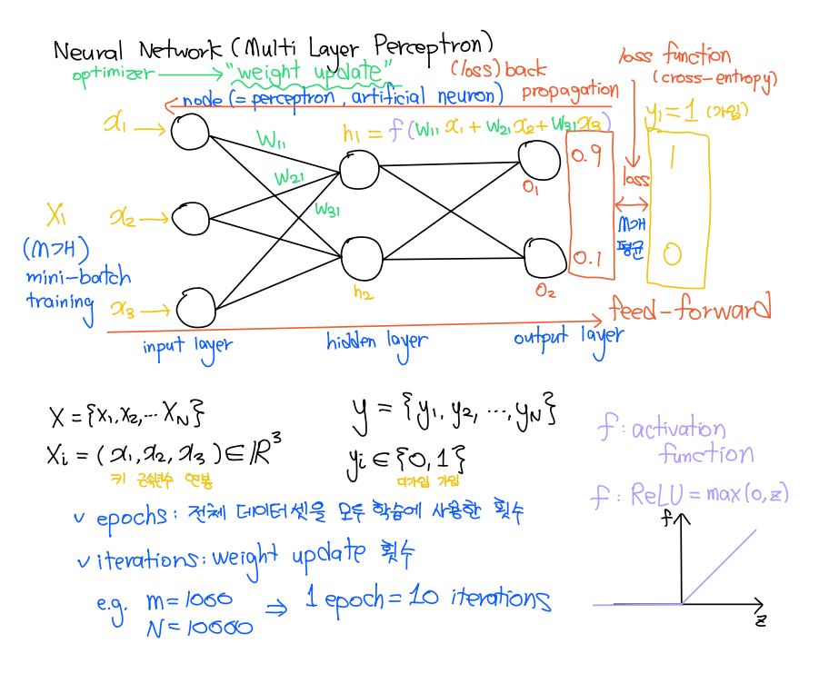

    용어 파악을 위한 기초 정리🍺

### 딥러닝 개념도

### 중요 개념(자주 사용하는 용어 만 정리)

1. Optimizer
    * Optimizer란, 모델이 학습을 통해 최적의 **가중치(weight)**와 **편향(bias)**을 찾을 수 있도록 도와주는 알고리즘
    * 딥러닝 모델은 입력 데이터와 이에 대한 **Label(정답) 데이터**를 사용하여 예측을 수행
    * 예측 결과와 실제 결과 사이의 **Loss(오차)**가 발생
    * 오차를 최소화 하기 위해 Optimizer를 사용
    * 대표적인 Optimizer는 **Adam** 사용, 최신 트렌드는 Adam W 사용

2. Batch
    * 딥러닝에서 batch란, **학습 데이터**를 **일정한 크기의 묶음 단위로 처리**하는 것을 의미
    * 가중치와 편향을 업데이트할 때 모든 데이터를 한번에 처리하면 연산 비용이 크기 때문에 일정한 크기의 묶음(batch) 단위로 처리하여 학습 속도와 효율성을 개선

3. Learning Rate
    * Optimizer가 모델의 가중치(weight)를 업데이트할 때, **이전 가중치 값에서 얼마나 크게 업데이트할지를 결정하는 하이퍼파라미터**

4. Epochs
    * 데이터를 넣는 횟수를 1 epochs라고 함
    * ex. 데이터 15만개 중 5만개를 넣었다고 가정하면, 3 epochs

5. Cross Entropy
    * 딥러닝에서 분류(classification) 문제에서 많이 사용되는 손실 함수(loss function) 중 하나

6. Transfer Learning
    * 딥러닝에서는 일반적으로 이미지나 텍스트 데이터 등에서 많이 사용
    * 전이 학습을 사용하면 적은 양의 데이터를 가지고도 높은 성능을 달성